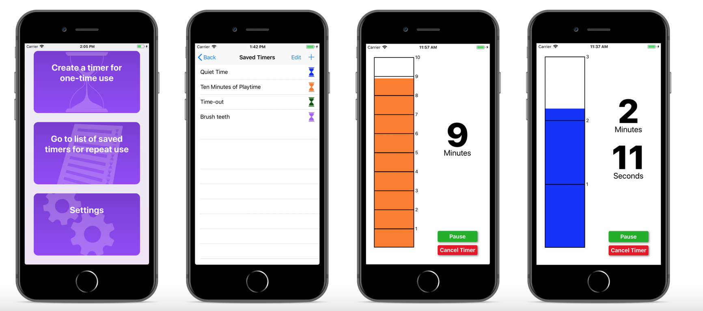

### Visual Timer
Visual Timer is an iOS app that gives a clear, rectangular  display of elapsing time. Preschoolers and young children often have difficulty connecting the numerical representation of the timer with the circular representations that are used as the most  common visuals. At the time I began working on this app, all timers available in the app store used either ring or pie representations.

This is an app that I had intended to submit to the app store at one point in time, but since I never got around to it (for reasons that had nothing to do with the coding of the app) I have made the code public as a demonstration of my skills.  The following is what I had intended to put on the app's website.

---

<h4> Keep an eye on your timer!</h4>

Visual Timer lets you create, save, and use commonly used timers with a clear visual it's clear at a glance how much time is left.

                                        

Visual Timer was written with parents of small children in mind. It allows a preschooler whose sense of time is still developing to tell how much time is left, while also being useful for adults who want a quick visual to keep them on track.

Timer features:
<ul>
<li>Name and save timers that you use repeatedly</li>
<li>Make timer auto-start when selected</li>
<li>Make timer pausable (or not! to prevent little fingers from pausing it)</li>
<li>Make timer cancelable (or not!)</li>
<li>Choose color of time bar</li>
<li>Choose from more than 25 sounds for alerting you that timer is done, with choices varying from mellow and relaxing to annoying and unignorable.</li>
<li>Choose whether to loop alert audio at the end so you can't possibly miss it</li>
<li>Display can change between minutes only (for early math connections) or more precise minutes and seconds.</li>
</ul>

 
